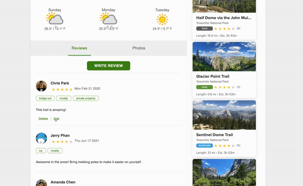

# SomeTrails

## Live Link

[SomeTrails](https://some-trails.herokuapp.com/#/ "SomeTrails Home Page")


## About

SomeTrails is a clone of AllTrails where users can browse through parks and the trails within them to gather general information. On the home page, there is a photo slider that showcases some of the trails where users can click on the photo-card they are interested in. The user will be redirected to the trail page where they can look up general information of the trail such as directions, facilities, contact information, etc. Users will also be able to create, read, update, and delete reviews and also upload their own photos.

SomeTrails backend is built using the Ruby on Rails framework, PostgreSQL, AWS S3 storage for photos used in the frontend. The frontend is built using React, Redux, and SCSS. jQuery is used to send all AJAX calls from the frontend to the backend..

## Features
### CRUD For Reviews


Users will be able to create/read/update/destroy reviews for trails. To create a review, a user simply has to click on the "Write Review" button and a 2-part modal form will popup. One the first page, user will select a rating and write their review. Once done, they can click the next button and select the date, trail condition tags and select the Post button to create the review.




Users will also be able to edit any of their reviews and freely change any of the parameters to their liking, including the trail condition tags.

```javascript
handleCheckbox() {
  let checkboxes = Array.from(document.getElementsByClassName('checkbox-input'))

  let tagArr = [];
  checkboxes.forEach((input) => {
    if (input.checked) tagArr.push(input.value)
  })
  this.setState({conditions: tagArr})
}
```

### Search Bar


Users can find a park or trail using the search bar in the middle of the home page. The search bar was created 